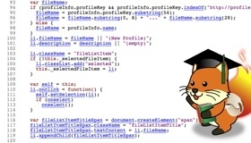

## FxOS Code Reading
# Meetup

---
## Facility

   * WiFi: Refer to the leaflet on the table.
   * Hashtag: &num;fxos
   * WC 

---
## Suponsor

## Mozilla Japan
## GCG (Global Cyber Group)

---
## Agenda

   * Opening
   * Self introduction (ALL)
   * Chat! Eat! Read!
   * Drink! (20:30~)
   * Closing (22:30)

---
## Self introduction

   * Name
   * What do you do? What do you like?
   	- Job, Community, etc.
   * About FxOS 
